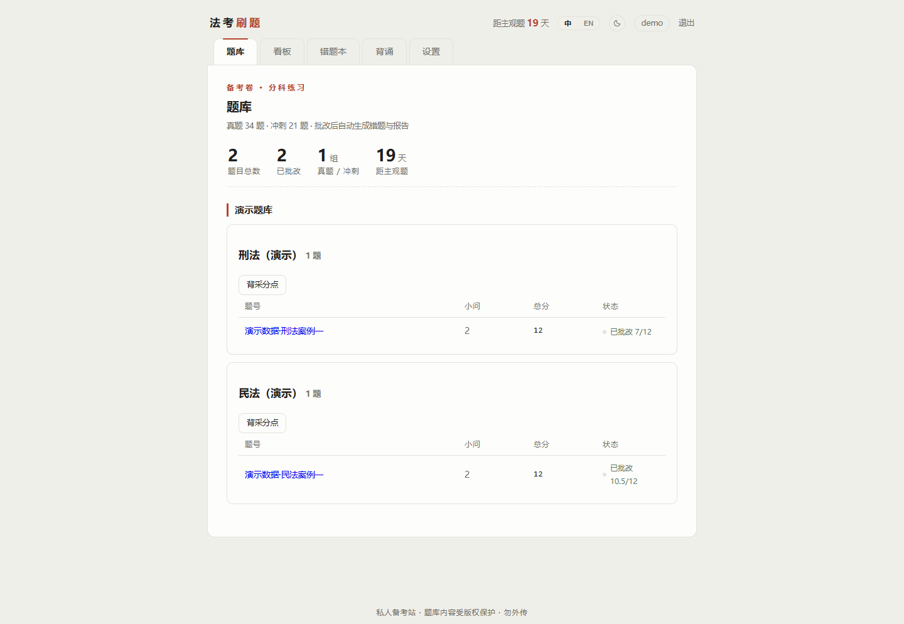
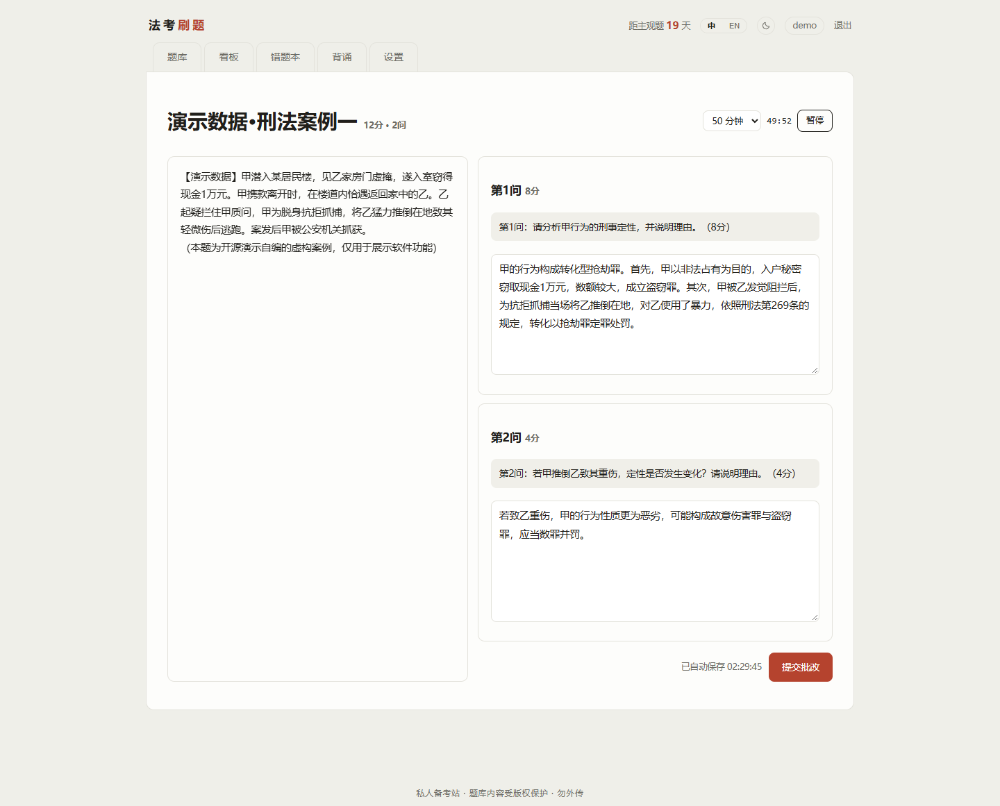
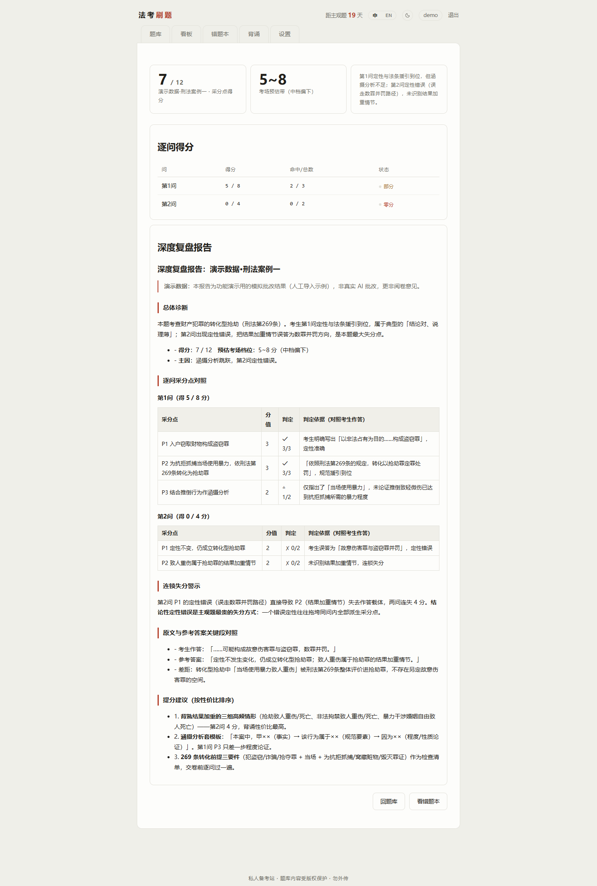
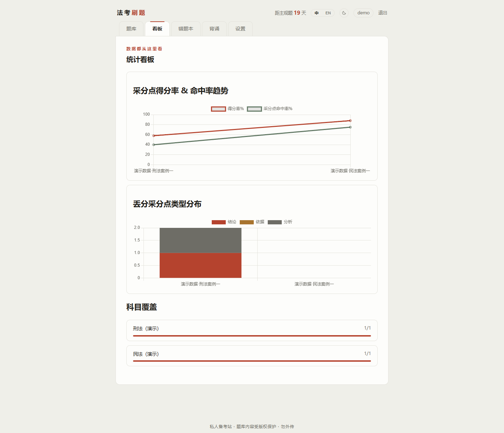

English · [简体中文](./README.zh-CN.md)

[](https://github.com/1438388098-glitch/fakao-shuati/actions/workflows/ci.yml)

# fakao-shuati — Self-Hosted Bar-Exam Essay Practice Platform

A self-hosted practice site for the Chinese bar exam (法考) essay paper: question bank browsing, timed answering, **AI grading against official scoring points** (✓ full / △ partial / ✗ miss), in-depth review reports, statistics dashboard, wrong-answer book and scoring-point recitation mode. Single-process Express + Node's built-in SQLite — zero native dependencies, runs on a cheap VPS. 5 smoke tests cover the full grading chain with a mocked AI API.

> **This repository contains no questions, answers, or scoring-rubric data of any kind.** You must supply question-bank files you are legally entitled to use (format below) and place them into the data directory yourself.

## Features

- **Question bank**: browse by subject/group, per-question status tracking (not attempted / draft / graded)
- **Answering**: two-column card layout (stem stays pinned on the left), independent answer box per sub-question, 5-second autosave, exam-day countdown, mock timer
- **AI grading**: one-click submit; the AI judges each scoring point (✓ full / △ half / ✗ miss) and outputs an in-depth review report (point-by-point comparison, cascade-loss warnings, answer-vs-response comparison, improvement advice)
- **Reports**: Markdown in-depth review + structured score data; manual import of third-party reports supported
- **Statistics dashboard**: score-rate and scoring-point hit-rate trends, missed-point type distribution (conclusion / basis / analysis), subject coverage progress
- **Wrong-answer book**: derived automatically from missed scoring points; re-attempt a question to clear its entries
- **Recitation**: flashcard-style scoring-point memorization; mark points as mastered
- **Multi-user**: data isolated per account (suitable for sharing one server with friends)
- **Dark/light theme**: follows the system + manual toggle

## Screenshots

All screenshots use **demo data** (fictional cases written for this demo plus simulated grading reports — the repository ships no question content whatsoever); no real user data is included.

| Question bank | Timed answering |
|---|---|
|  |  |
| *Question bank (demo data)* | *Timed answering — stem pinned left, countdown visible (demo data)* |
|  |  |
| *In-depth review report (demo data)* | *Statistics dashboard (demo data)* |

## Quick Start

Requires Node.js ≥ 22.5 (uses the built-in `node:sqlite`).

```bash
npm install
FAKAO_DATA_DIR=./题库数据 npm start   # default: http://127.0.0.1:3210
```

1. On first visit, open `/setup` to create the admin account (no account is pre-created).
2. Put your question-bank files into the `FAKAO_DATA_DIR` directory (default `./题库数据`, a Chinese directory name meaning "question-bank data"); format below.
3. Fill in the AI API on the "Settings" page (or use environment variables, see below).
4. Answer questions, submit, wait for the report.

### Environment Variables

| Variable | Description | Default |
|---|---|---|
| `PORT` | Listening port | `3210` |
| `BASE_PATH` | Sub-path deployment behind a reverse proxy (e.g. `/shuati`) | empty |
| `DATA_DIR` | Runtime data directory (SQLite, answers, grading records) | `./data` |
| `FAKAO_DATA_DIR` | Question-bank data directory (read-only) | `./题库数据` |
| `AI_MODE` | `api` / `cli` / leave empty for auto | auto |
| `AI_FORMAT` | API format: `openai` (/chat/completions) or `anthropic` (/v1/messages) | `openai` |
| `AI_BASE_URL` | API endpoint, up to the version segment, e.g. `https://api.deepseek.com/v1` | — |
| `AI_API_KEY` | API key (can also be set on the Settings page; stored in the server's own database, the page echoes only the last 4 characters) | — |
| `AI_MODEL` | Model name, e.g. `deepseek-chat` / `glm-4.7-flash` / `gpt-4o-mini` | — |
| `AI_MAX_TOKENS` | Output cap per grading run | `16000` |

Any OpenAI-compatible endpoint (OpenAI / DeepSeek / Zhipu GLM / Kimi / local ollama + gateway, etc.) and any Anthropic-compatible endpoint works: fill in Base URL + Key + model name on the Settings page — **switching models requires changing zero lines of code**.

## Question Bank Data Format

Under `FAKAO_DATA_DIR`, one `*_raw.json` per subject; the subject list is defined by `subjects.json` in the same directory (when absent, all `*_raw.json` in the directory are scanned automatically; see [`examples/subjects.example.json`](examples/subjects.example.json) for an example):

```json
[
  { "file": "刑法_raw.json", "key": "xingfa", "name": "刑法（真题）", "alias": "刑法", "group": "历年真题" }
]
```

- `key`: the subject identifier used in URLs and the database; **must not be changed** once the database is created
- `alias`: the subject name used in the grading prompt
- `group`: group heading shown on the bank page (e.g. "past papers", "sprint specials")

Question file format:

```json
{
  "data": [{
    "id": 12345,
    "sn": "2025",
    "snText": "2025年·真题·第2题",
    "question": "题干（支持换行，HTML 标签会被剥离）",
    "score": 32,
    "subList": [{
      "subOrder": 1,
      "subQuestion": "第1问：分析甲的刑事责任。",
      "subScore": 6,
      "answer": "参考答案全文……",
      "subKeyWord": "[{\"text\":\"甲构成故意杀人罪\",\"score\":3,\"whiteList\":[{\"text\":\"故意杀人\"}],\"blackList\":[]}]"
    }]
  }]
}
```

`subKeyWord` is the **scoring-point rubric** (a JSON string) — the heart of AI grading quality:

| Field | Description |
|---|---|
| `text` | The scoring point statement (what the AI judges against) |
| `score` | Points for this item (the items sum to the sub-question's score) |
| `whiteList` | Equivalent expressions (hit any and the point counts as made) |
| `blackList` | Blacklisted expressions (a wrong conclusion written by the examinee, triggering cascade loss) |

The test fixture [`test/smoke.test.cjs`](test/smoke.test.cjs) contains a minimal, runnable complete example.

## How AI Grading Works

After a submission, the platform assembles the stem, per-sub-question scoring points (with white/black lists), reference answers and grading rules into a prompt and sends it to the AI, asking it to:

1. Judge point by point (✓ full / △ half / ✗ zero, never negative), tagging each point's type (conclusion / basis / analysis) and confidence;
2. A wrong conclusive characterization triggers cascade loss on dependent points;
3. Output structured JSON (stored in the database, feeds the wrong-answer book) + a Markdown in-depth review report (written to `data/批改记录/`, a directory whose name means "grading records").

Three grading modes (switchable on the Settings page):

- **Direct API** (recommended): just fill in the three fields from the table above;
- **Local CLI** (advanced): invoke a local AI coding CLI (`GRADER_CMD`, e.g. `claude -p {prompt}`) together with the [fakao-grader grading skill](https://github.com/1438388098-glitch/fakao-grader);
- **Manual import**: if everything else fails, paste JSON + Markdown on the report-import page.

There is also a second-level fallback: `WORKER_TOKEN=xxx SERVER=https://your-domain npm run worker` runs a grading worker on a machine that has AI access, automatically claiming failed tasks from the server.

## Deployment & Security

- This project is designed for **private self-hosting**: site-wide password protection, `noindex` response headers, and the worker API guarded by a random token. Do not expose it publicly on the open internet unprotected, or at least add a reverse-proxy basic auth layer.
- The API key is stored in your own server's SQLite database — never in code, never in logs.
- Reverse proxy example (nginx, sub-path):

```nginx
location ^~ /shuati/ {
    proxy_pass http://127.0.0.1:3210;
    proxy_set_header Host $host;
    proxy_set_header X-Forwarded-For $remote_addr;
}
```

## Testing

```bash
npm test
```

5 smoke tests: question-bank loading, the authentication data chain, report ingestion into the database, Markdown rendering, and an **end-to-end mocked-API grading** (spins up a local fake endpoint and runs the full `processOne` chain).

## Copyright & Disclaimer

- This repository is a pure tool and **contains no copyrighted questions, answers, explanations, or scoring rubrics**.
- Users must supply question data they are legally entitled to use, for personal study only; do not redistribute.
- AI grading results are for practice reference only and differ from real exam marking.

## License

[MIT](LICENSE)
